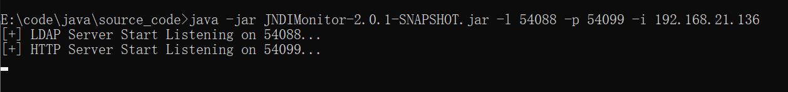
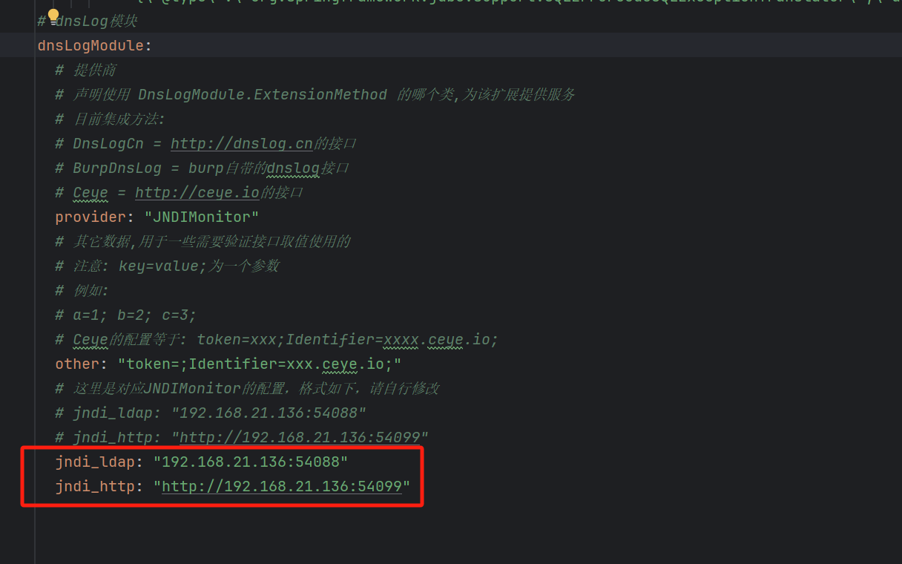
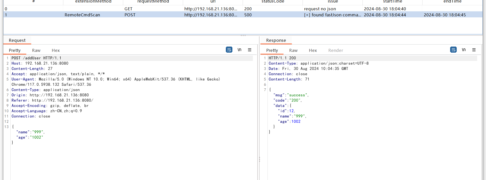
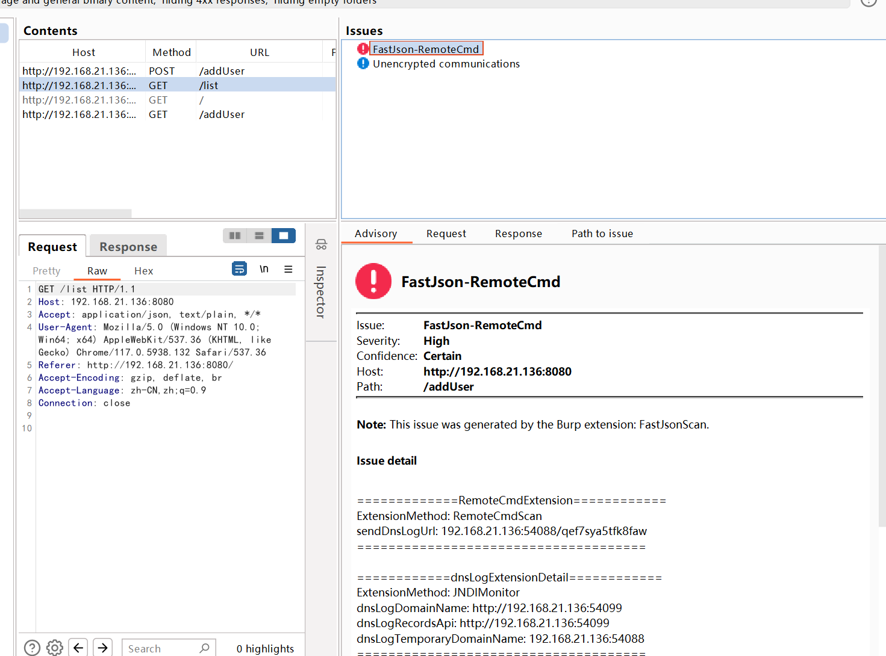

# BurpFastJsonScan_modified
fastjson burp插件，用于内网环境下使用，直接用ip起jndi服务，解决dnslog在内网不可用的问题

## 简述
一天需要对企业内网的站点进行 fastjson 检测

内网是不出网的，公网的 dnslog 检测方式肯定是没用不上的

而负责域名的那边也没法给个域名搭建 dnslog 平台

所以就有了这个

## 项目成分
已经有大佬写好了相关的项目了，造轮子就浪费时间了

pmiaowu 的 fastjson 检测：[BurpFastJsonScan](https://github.com/pmiaowu/BurpFastJsonScan)

r00tSe7en 的 LDAP请求监听器：[JNDIMonitor](https://github.com/r00tSe7en/JNDIMonitor)

本项目略微修改了下 BurpFastJsonScan 的代码（大佬的代码很优雅，修改局部不影响全局）

## 使用方法
### 1、启动JNDIMonitor

### 2、修改BurpFastJsonScan配置
直接编译项目，然后在 target\BurpFastJsonScan\resources\config.yml 中根据启动JNDIMonitor的端口修改配置

## 效果
这里用靶场测试下

靶场项目：[fastjson-rce](https://github.com/dbgee/fastjson-rce)

## 最后
感谢[pmiaowu](https://github.com/pmiaowu/BurpFastJsonScan)

感谢[r00tSe7en](https://github.com/r00tSe7en/JNDIMonitor)

感谢[dbgee](https://github.com/dbgee/fastjson-rce)

